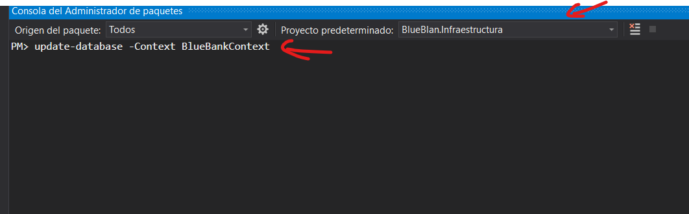

# BlueBank

Estas es una pequeña aplicacion web que realiza la gestion de cuenta de ahorro de un banco que se conecta para consumir los datos de una API


## Supuestos de negocio y Solucion del problema:

### Supuestos: 

Esta es una aplicacion web que realiza las operaciones basicas de un proceso de ahorro de cuentas en BlueBank.

#### Para ello es necesario:
+ Crear un cliente al que se le vinculara la cuenta.
+ Crear un cuenta de ahorro con un monto inicial.
+ Realizar el proceso de Consignacion a un numero de cuenta determinado.
+ Realizar el proceso de Retiro a un numero de cuenta determinado.
+ Realizar la consulta de la cuenta con un numero de cuenta determinado.

### Pendientes: 

Esta aplicacion web es un pequeño prototipo de la gestion de cuenta de ahorro de un banco, por ello es una pequeña parte de una gran cantidad de reglas de negocio que puede contener un oragnizacion como esta.
Al contar con mayor tiempo se podria:
+ Crear mas reglas de nogocio en este.
+ Atacar las busquedas de los clientes.
+ Darle un diseño mas formal deacuerdo a las metricas de la organizacion.
+ Mostrar mas informacion del cliente al consultar la cuenta.


### Aplicacion Web

Se creo una aplicacion donde aplica todas las reglas de negocio que se plantean anteriormente


#### Demo
Aquí hay una demostración en vivo funcional :  https://bluebankapp.herokuapp.com/
##### Credenciales
Usuario: Admin

Contraseña: Admin123*
#### Pagina de Incio
En esta pagina el usuario administrador tendra que loguearse para poder accder a la opciones de la aplicacion


#### Pagina principal


#### Pagina de consulta de cuenta


#### Soporte Movil
Esta aplicacion web es compatible con dispositvos moviles y se adapta a la pantalla


## Tecnologia utilizada: 

La tecnologia utilizada en este proyecto esta dividida en dos areas:

+ Frontend.
+ Banckend.

#### FrontEnd 


 En el frontend se utilizo Angular 8 como framework prinicipal para desarrollar la peticiones a la API, asi mismo el diseño y animaciones de la pagina.
 
 Se utilizaron muchas de las herramientas que nos brinda angular para la seguridad de la aplicacion y para el desarrollo de la misma aplicacion. 

#### BackEnd


 En el backend se utilizo .NET Core 3.1 como framework prinicipal para desarrollar la Web API, con .NET Core se utilizo una arquitectura desacoplada en cada una de sus capas esto para que la api se escalable y mantenible.

 Se hizo uso de los Nuget para instalar dependecias como JWT para la seguridad y autorizacion de la misma e IdentityUser para la gestion de usuarios y roles.


## Arquitectura de la aplicacion web:
### Autenticacion Angular
La arquitectura utilizada para esta aplicacion es la siguiente:
se utiliza JWT para la autenticacion de usuarios, esto para darle mas seguridad a la apliacion, cada peticion realizada a los endpoint de la API estan restringidas por la autorizacion, es por ello que la aplicacion cuenta con un sistema de seguridad para la utenticacion de usuarios.


### Web API .Net Core

El desarrollo de la web api se realizo con una arquitectura orientada a dominio(DDD), ya que suponiendo la gran cantidad de reglas de negocio que podria tener un banco, este tipo de arquitectura es ideal para organizaciones de este tipo. Asi mismo haciendo uso de esta podemos desacoplar cada capa de estas y que las reglas del negocio o el dominio no dependa de la tecnologia, si no que esta dependan del dominio. 

Esta arquitectura es flexible para hacerle pruebas unitarias a cada capa por su desacoplamiento que posee en cada capa.  


## Instalacion

### Ambiente local

#### Frontend Angular
Este proyecto fue generado con Angular CLI versión 8.2.0.

Para poder ejecutar este proyecto es necesario tener:

+ nmp versión +6.9 <br>
+ Linea de Comandos <br>
+ CLI versión +8.2.0.<br>

### Ejecute:

Ejecutar `ng serve` para un servidor de desarrollo. Navegue a `http://localhost:4200/`. La aplicación se volverá a cargar automáticamente si cambia alguno de los archivos de origen.


#### Backend .Net Core

Este proyecto fue creado con la version .NET Core 3.1

para poder ejecutar este proyecto es necesario tener instalado lo siguiente:

Visual Studio +2019 
Visual Studio Code 

### Compile y Ejecute:

Una vez descargado el proyecto compile para generar los bin y ver que no exista problema
Ejecute la siguiente sintaxi en la terminal:
```cs
update-database -Context BlueBankContext
```
